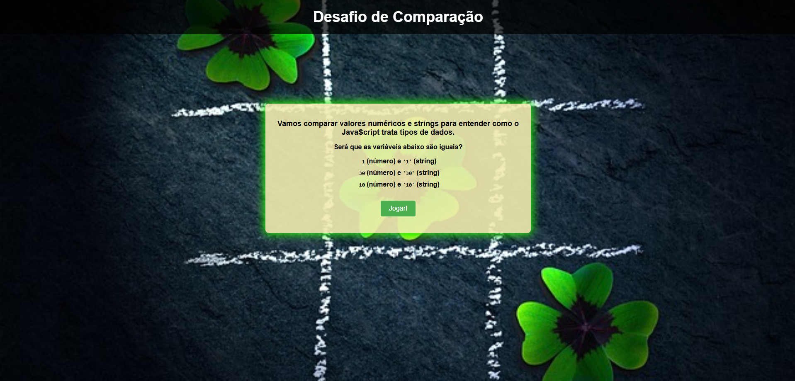
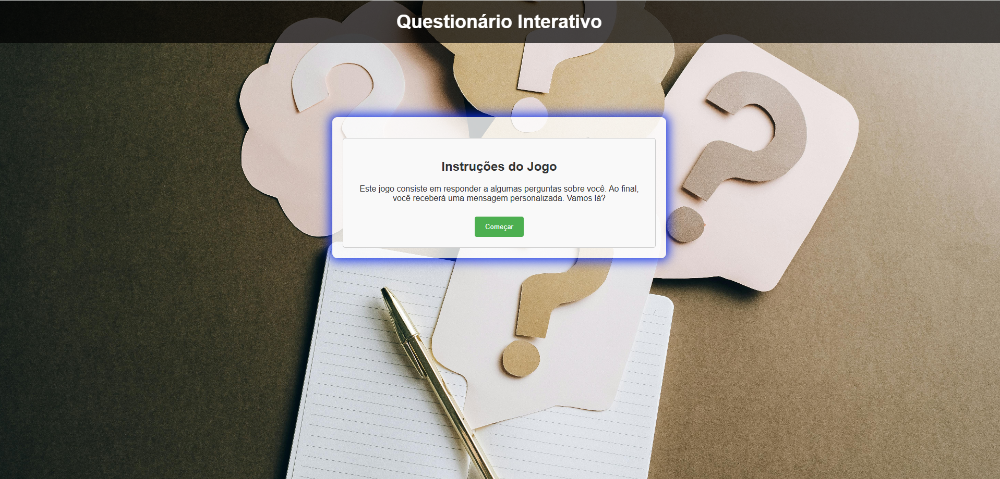
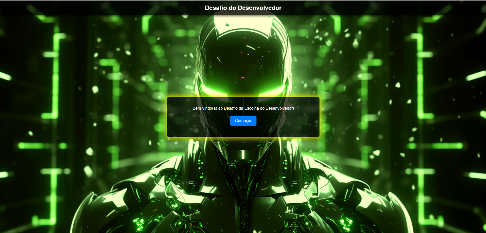
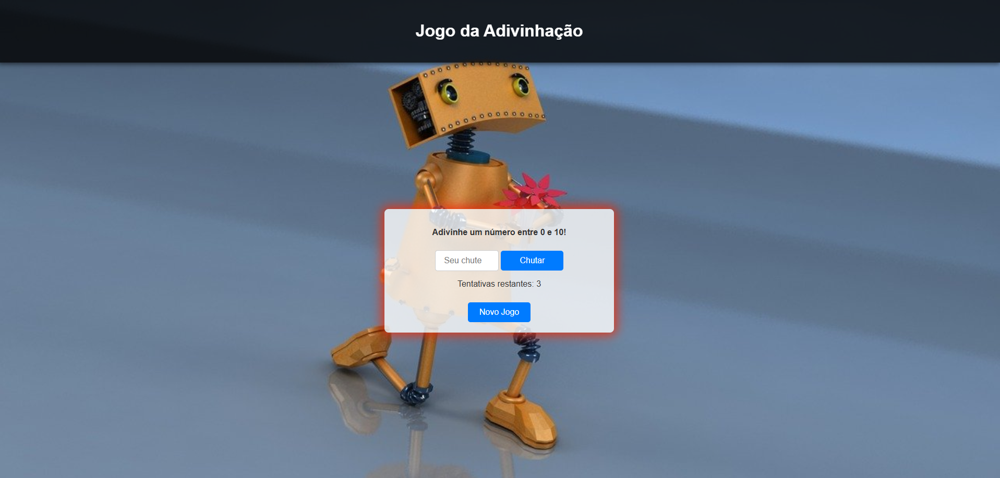
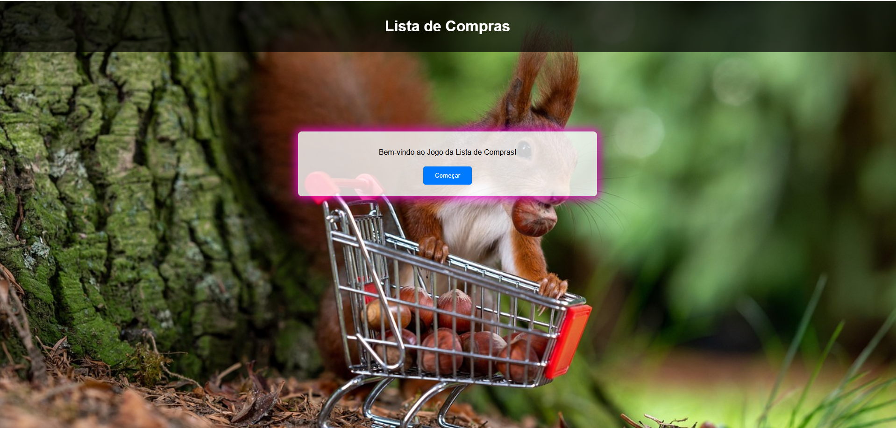
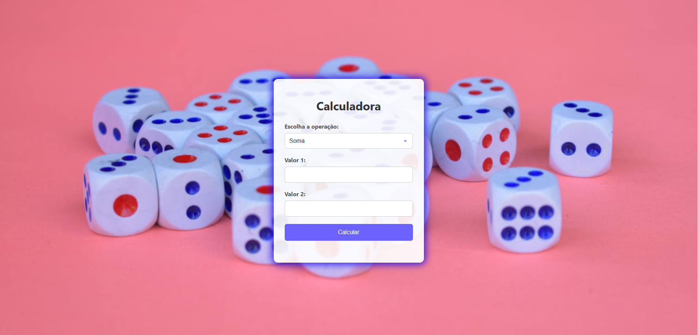

# 7 Days de Lógica com JavaScript

---

O **7 Days de Lógica com JavaScript** é um desafio proposto pela **Alura One** para aprimorar conhecimentos em JavaScript, a linguagem de programação mais utilizada no mundo. Durante essa jornada, serão explorados conceitos fundamentais como variáveis, condicionais e estruturas de loop para resolver problemas do dia a dia.

Ao longo dos sete dias de desafios, será possível desenvolver habilidades essenciais para qualquer pessoa que deseja ingressar na programação. Com a prática constante, a sintaxe dos comandos se tornará mais natural, permitindo um maior foco na resolução de problemas.

---

## 🌟 Desafios Diários

### ✨ **Dia 1: Condicionais e Operadores Booleanos**
No primeiro dia, o foco será o comando **if** e operações booleanas no JavaScript. Pequenos detalhes podem fazer toda a diferença no código, trazendo um resultado esperado ou inesperado dependendo da implementação.

### 💡 **Dia 2: Captura de Inputs e Variáveis**
Neste dia, será abordada a captura de dados do usuário e o armazenamento dessas informações em variáveis, tornando o código mais dinâmico e interativo.

### 📚 **Dia 3: Narrativas Dinâmicas e Loops**
Os conceitos aprendidos nos dias anteriores serão utilizados para criar uma narrativa interativa. Aqui, os loops serão empregados para manter a história em execução até que o usuário decida parar.

### ⚔️ **Dia 4: Criando um Jogo Aleatório**
No quarto dia, será trabalhada a **aleatoriedade**, criando um jogo onde o programa gera resultados imprevisíveis!

### 🗂 **Dia 5: Trabalhando com Listas (Arrays)**
Listas são fundamentais na programação! Neste dia, serão manipulados **arrays** para armazenar e gerenciar grandes volumes de informações de forma eficiente.

### ❌ **Dia 6: Removendo Itens de uma Lista**
Após aprender sobre manipulação de listas, será possível remover itens específicos delas, garantindo uma melhor gestão dos dados.

### 🎨 **Dia 7: Organização de Código e Projeto Final**
No último dia, todo o conhecimento adquirido será aplicado no desenvolvimento de um **projeto maior**. Aqui, será perceptível como a organização (ou falta dela) pode impactar a produtividade e a manutenção do código.

---

## 🌟 Desafio Extra: Escolhas no Mundo da Programação 

Além dos desafios diários, haverá um jogo interativo para escolher entre:

1. **Front-End ou Back-End**
   - Para quem optar por **Front-End**, poderá aprender **React** ou **Vue**.
   - Para quem optar por **Back-End**, poderá aprender **C#** ou **Java**.

2. **Especialização ou Fullstack?**
   - O participante poderá se especializar em uma área ou seguir o caminho Fullstack.

3. **Explorando Novas Tecnologias**
   - Será possível adicionar quantas tecnologias quiser na lista de aprendizado e descobrir novas oportunidades!

---

## 📸 Prévia do Projeto  

---

🎨 **Créditos:** Este desafio faz parte de uma série de práticas promovidas pela **Alura One** para aprimorar a lógica de programação com JavaScript.

📌 **Instrutora:** [Rafaella Ballerini]